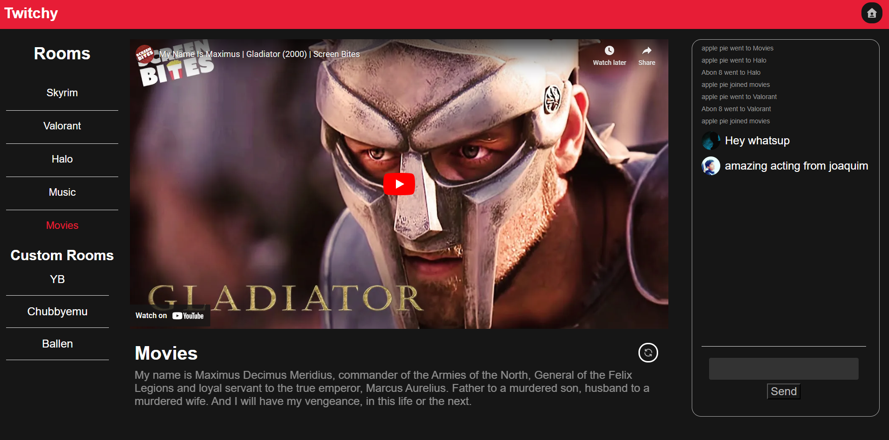

# Twitchy
Twitchy is a Watch Party Application designed for friends to watch movies, TV shows, and live events together, no matter where they are in the world. The app allows users to create their own virtual theater and invite friends to join in on the fun.

# Features
* Join Default or Custom Rooms
* Live Chat
* Logs
* Real Time Video Synchronization

# Getting Started
* To get started with Twitchy, simply download the repository and create two terminals.
* Run `npm install`.
* Install relevant dependencies, such as `socket.io`.
* Navigate to /server and run `npm start`.
* Navigate to /client/twitch4 and run `npm start`.
* This will open up a localhost application on your browser, and you can start using the app!